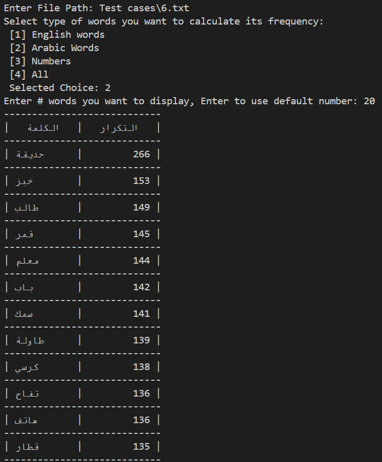

# Word Frequency Analyzer

## Option selected:
3 – Word Frequency Analyzer

---

## How to run the code:

1. Open terminal and run:  
   ```bash
   python word_frequency.py
    ```
2. Enter the path to the test case file (if it's in the same folder, you can use a relative path).
3. Enter the number that represents the word type you want to analyze for frequency.
4. After filtering and calculating word frequencies, enter a number `n` to display the top `n` most frequent words with their counts, or press Enter to use the default value.


---

## Languages, Tools & Libraries used:
### Language: 
 - **Python 3.13.5**

### Tools
- **Visual Studio Code (VSCode)**
- **Git** & **GitHub**

### Libraries:

- **matplotlib**: Generates bar charts to visualize word frequency results.
- **collections.Counter**: Efficiently counts occurrences of each word in the text.
- **re (Regular Expressions)**: Extracts words by filtering out punctuation and splitting text.
- **arabic_reshaper**: Reshapes Arabic text for correct display, fixing letter forms.
- **bidi.algorithm.get_display**: Adjusts bidirectional text (e.g.,  Arabic mixed with English) for proper right-to-left display.
- **pandas**: Used for data manipulation and tabular display.

## Output Files

- **CSV File**  
  - The program saves the word frequency results in a `.csv` file for easy access and further analysis.  
  - Each row contains a word and its corresponding frequency count.
  <p align="center">
  
  </p>

- **Bar Chart Image**  
  A bar chart visualizing the top frequent words is automatically generated and saved as an image file.  
  This helps users quickly understand the distribution of word usage.

---
## Exception Handling

The program includes robust exception handling to ensure smooth execution and clear feedback for users.  
Handled exceptions include:

- **FileNotFoundError**: Triggered when the provided file path does not exist.
- **re.error**: Raised if the regular expression pattern is invalid.
- **ValueError**: Occurs when there's no valid data to display (e.g., empty file).
- **General Exception**: Catches any unexpected errors and displays their type and message.

## Extra Features:
- Includes `generate_testcases.py` to create sample test case files.
- Supports Arabic words, handling correct reshaping and display direction.
- Allows user input to specify how many top frequent words to display.
- Provides an option for the user to choose which types of words to include in the analysis:  
  *(e.g., English words only, Arabic words only, numbers only, or mixed)*.

> ⚠️ Note: If Arabic text looks distorted in Excel, it's likely a display issue. The file is UTF-8 encoded and displays correctly in VS Code or Notepad.